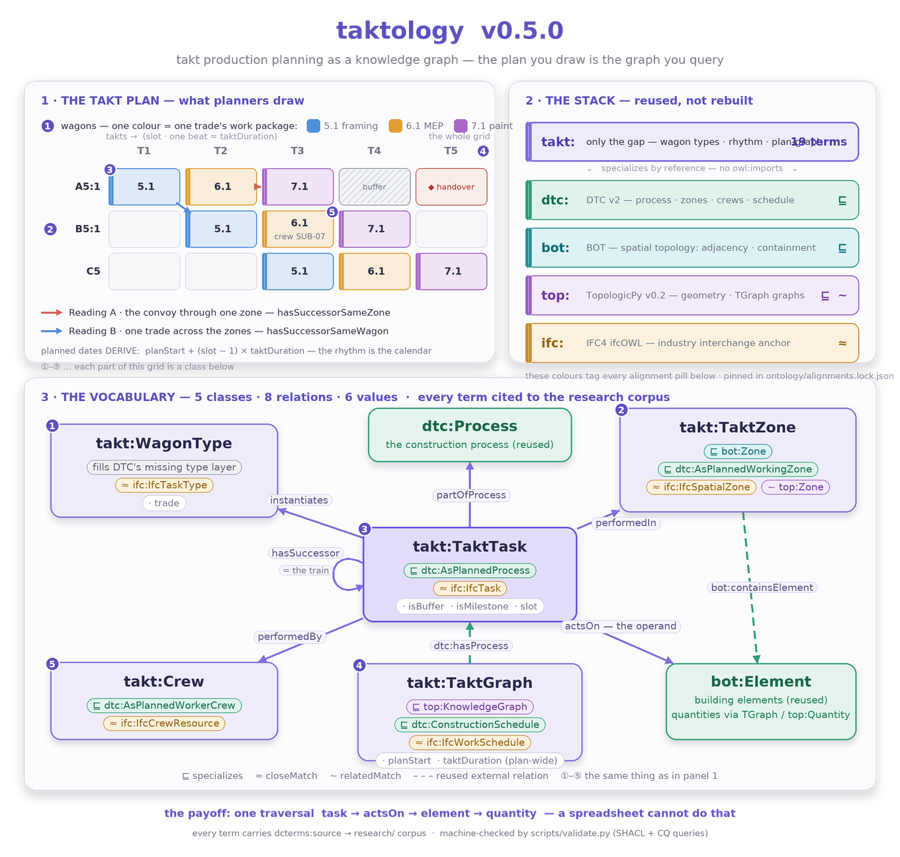

# Taktology

<!-- ONTOLOGY-DIAGRAM:START (generated by scripts/generate_ontology_diagram.py — do not edit) -->

<p align="center">
  
</p>

<!-- ONTOLOGY-DIAGRAM:END -->

<!-- TAKT-SCHEME:START (generated by scripts/generate_takt_scheme.py — do not edit) -->

<p align="center">
  
</p>

<!-- TAKT-SCHEME:END -->

A minimal, modular interchange vocabulary for **takt / Lean construction production
planning** — the kind of plan you build as a coloured grid of *wagons* flowing
through *takt zones* over time.

It models the **takt-specific** half of takt planning (the wagon type-layer, the
takt rhythm, and the plan-as-graph) as a thin layer that **reuses the
[DTC ontology v2](https://dtc-ontology.cms.ed.tum.de/ontology/v2/)** (`dtc:`) for the
process / working-zone / crew / schedule backbone, uses [TopologicPy](http://w3id.org/topologicpy)
(`top:`) as the geometry/graph engine, and is anchored to IFC process concepts
(`IfcTask`, `IfcRelSequence`, …) by `skos:closeMatch` — **not** by importing the heavy
ifcOWL schema. DTC v2 **imports** [BOT](https://w3id.org/bot#) and the takt zone
subclasses `bot:Zone` directly, so `dtc:` and `top:` don't just meet at BOT — they
compose on it by design.

> Origin: this repo synthesises a research conversation across two strands — the
> **BIMTakt** paper (Becker & Tschickardt, 2023) and the **Chalmers BIM-takt research**
> (Ljung, Viklund Tallgren, Roupé & Johansson — the spatio-temporal breakdown structure
> / TBS, BIM-based takt, Total BIM) — toward an interoperable, manufacturer-neutral
> model. See [docs/](docs/) for the full reasoning.

## What's here

| Path | What it is |
|---|---|
| [`ontology/takt.ttl`](ontology/takt.ttl) | **The vocabulary** (T-Box), v0.5.0 minimal core. 19 terms: 5 classes, 8 object properties, 6 datatype properties — each `dcterms:source`-cited to the research corpus, each aligned to DTC v2 + IFC. The takt zone subclasses `bot:Zone` directly (topology/adjacency); the plan itself is a `takt:TaktGraph` ⊑ `top:KnowledgeGraph` + `dtc:ConstructionSchedule`; a takt task is `partOfProcess` a `dtc:Process` (Ljung 2026, spatio-temporal breakdown). |
| [`examples/takt-flowline-demo-b5-1.ttl`](examples/takt-flowline-demo-b5-1.ttl) | A worked **A-Box** — wagon 5.1 in zone B5:1 from the anonymized [takt-flowline-demo](examples/takt-flowline-demo.md) plan: the single-zone core plus the BOT topology a takt zone carries. |
| [`examples/takt-train-demo.ttl`](examples/takt-train-demo.ttl) | The **train** A-Box — two wagons through two adjacent zones over three takts, exercising both successor readings (`SameZone` / `SameWagon`) and a capacity buffer. |
| [`examples/takt-building-demo.ttl`](examples/takt-building-demo.ttl) | The **building-scale A-Box** driving the visualizer — an anonymized 3-storey building, 6 takt zones, a 5-wagon interiors train (framing → MEP rough-in → drywall → MEP fixtures → paint/floor) flowing as a flowline over 11 takts. Generated by [`scripts/generate_building_demo.py`](scripts/generate_building_demo.py); validated by the SHACL shapes. |
| [`viz/index.html`](viz/index.html) | **The visualizer** — three application layers over one RDF graph: a takt-planning **plan grid**, the **knowledge graph**, and a **3D building** whose structural / architectural / MEP fit-out builds up takt-by-takt as you scrub the train. Serve the repo root and open `/viz/` (or double-click — an embedded data snapshot keeps `file://` working). |
| [`examples/takt-flowline-demo.md`](examples/takt-flowline-demo.md) | An anonymized slice of a real production plan (xlsx + csv) as a **discussion pattern** — the takt train, zones, and flowline behind the A-Boxes above. |
| [`shapes/takt-shapes.ttl`](shapes/takt-shapes.ttl) | **SHACL shapes** — the plan conventions as machine checks (buffers don't instantiate, slots ≥ 1, same-zone successors share a zone, same-wagon successors share a wagon type, …). |
| [`queries/`](queries/) | **Competency questions as runnable SPARQL**, paired with [docs/06-competency-questions.md](docs/06-competency-questions.md). |
| [`contexts/takt.context.jsonld`](contexts/takt.context.jsonld) | **JSON-LD context** — use the takt terms from plain-JSON tooling. |
| [`docs/05-tgraph-pairing.md`](docs/05-tgraph-pairing.md) | The **TopologicPy TGraph pairing contract** — how a TGraph-built plan projects into `takt:`, and how quantities travel (dictionary values / `top:Quantity`); worked script in [`examples/tgraph_pairing_demo.py`](examples/tgraph_pairing_demo.py). |
| [`scripts/validate.py`](scripts/validate.py) | **One-command validation** — parse, SHACL, A-Box↔T-Box term consistency, upstream alignment pins. |
| [`ontology/alignments.lock.json`](ontology/alignments.lock.json) | **Upstream pins** — the exact DTC v2 / TopologicPy v0.2.0 / BOT / ifcOWL snapshots the alignments were verified against. |
| [`schema/takt-topology-schema.yaml`](schema/takt-topology-schema.yaml) | Node + edge definitions for a **property-graph build** (Neo4j / NetworkX / rdflib), plus the generation loop. |
| [`scripts/takt_production_ingester_plan.md`](scripts/takt_production_ingester_plan.md) | Implementation plan for an **IFC + wagon-table → takt graph** ingester. |
| [`docs/`](docs/) | Architecture, vocabulary, design decisions (ADRs), BIMTakt background, TGraph pairing, competency questions. |
| [`research/`](research/) | **Research corpus** — 48 sources (38 fully verified, 10 partial — flagged per row in the [INDEX](research/INDEX.md)) grounding the design ([manifest](research/manifest.json), per-source notes, [ADR-001](research/decisions/ADR-001-research-grounding.md)). Includes a Chalmers cluster (BIM-takt, breakdown structures, Total BIM). |
| [`CHANGELOG.md`](CHANGELOG.md) | Version history — what changed in each release, and why. |

## The core idea

A **wagon** is a trade's work package; its per-zone occurrences are **takt tasks**;
the ordered chain of tasks is the **train** (no class — just the `hasSuccessor` chain);
the **takt zone** is the work area they flow through. One graph traversal runs from a
task to the very quantity that drives its duration (`task → actsOn → element →` its
TopologicPy-computed quantity, carried as a TGraph dictionary value / `top:Quantity`)
— which a spreadsheet cannot do.

## Design stance (the short version)

- **Author only the gap.** DTC v2 already provides the planned process, working zones,
  crews and the schedule container; the BIM model supplies the geometry/quantities —
  computed by TopologicPy (`top:`) or read straight off the IFC elements. This repo
  adds *only* what neither has — the wagon type-layer, the takt rhythm, and the
  plan-as-graph.
- **Reuse DTC v2; align, don't import.** Takt terms subclass DTC v2 by *reference*
  (no `owl:imports`); ifcOWL's ~14k axioms are never imported. Round-tripping to
  `.ifc` is a converter's job.
- **You haven't left IFC.** Classes align to IFC4 ifcOWL (ADD2_TC1 — the latest
  published ifcOWL; no official IFC 4.3 ifcOWL exists) by `skos:closeMatch`; object
  properties reference the objectified `IfcRel*` entities by `rdfs:seeAlso` only.
  IFC 4.3's process-extension concepts remain the conceptual anchor. You keep IFC's
  process model as the reference; you only choose whether the `.ifc` file is your
  transport format. Format ≠ semantics.
- **Planned dates derive.** `planStart + (slot − 1) × taktDuration` — the fixed rhythm
  IS the calendar model. DTC's `startTime`/`endTime` are *as-performed observations*
  and never carry planned dates.
- **`actsOn` ≠ `performedIn`.** A task's *operand* (the elements it builds/operates
  on) is a distinct, direct link — separate from the *location* (the zone). Anything
  computed per trade reads the operand, not the zone total.

Full rationale in [docs/03-decisions.md](docs/03-decisions.md).

## Research grounding

The design is evidence-based, not vibes. [`research/`](research/) is a curated corpus
of **48 sources** (38 fully verified, 10 partial — flagged per row in the
[INDEX](research/INDEX.md)) across takt theory, location-based planning, takt+BIM
automation, IFC/ontologies, implementation case studies, and a Chalmers cluster
(BIM-takt, spatio-temporal breakdown structures, Total BIM) — each tracing to a
decision via [ADR-001](research/decisions/ADR-001-research-grounding.md). The corpus's
headline finding: **no takt-specific ontology exists** in the literature (taktology
fills the gap), and geometry-driven takt zoning has little prior art (a build risk,
flagged honestly in [the gaps section](research/INDEX.md#gaps-where-taktology-designs-with-thin-evidence--most-valuable-section)).
Start at [research/INDEX.md](research/INDEX.md).

## Validating the ontology

One command runs the whole gate — Turtle parsing, SHACL shapes, A-Box↔T-Box term
consistency, and the upstream alignment pins:

```bash
python scripts/validate.py
```

All three Turtle files parse cleanly (rdflib 7.6, v0.5.0): `takt.ttl` = 177 triples,
`takt-flowline-demo-b5-1.ttl` = 43, `takt-train-demo.ttl` = 74. Alignment is by
reference (no `owl:imports`), so for a full reasoner check load DTC v2 and BOT
alongside (e.g. in Protégé) to verify the `subClassOf`/`subPropertyOf` axioms hold.

## Open items before publishing

- **Namespace.** `https://w3id.org/taktology#` is the *intended* permanent
  namespace; the w3id.org redirect must be registered first
  ([docs/07-publishing.md](docs/07-publishing.md) has the checklist). Until then it
  is a placeholder and does not resolve.
- **Schlenger mapping.** Schlenger builds on DTC, so the DTC alignment reaches it
  indirectly — but Schlenger's own ontology terms remain unextracted (its PDF was
  not machine-readable), so whether DTC covers its substance is unverified; a finer
  `takt:`↔Schlenger map is deferred.

## License

[CC BY 4.0](LICENSE) — Creative Commons Attribution 4.0 International. Reuse and
adapt freely (including commercially) with attribution. The referenced TopologicPy
ontology is AGPLv3, but this repo only references its namespace (it imports no
TopologicPy code), so it is not bound by AGPL.
