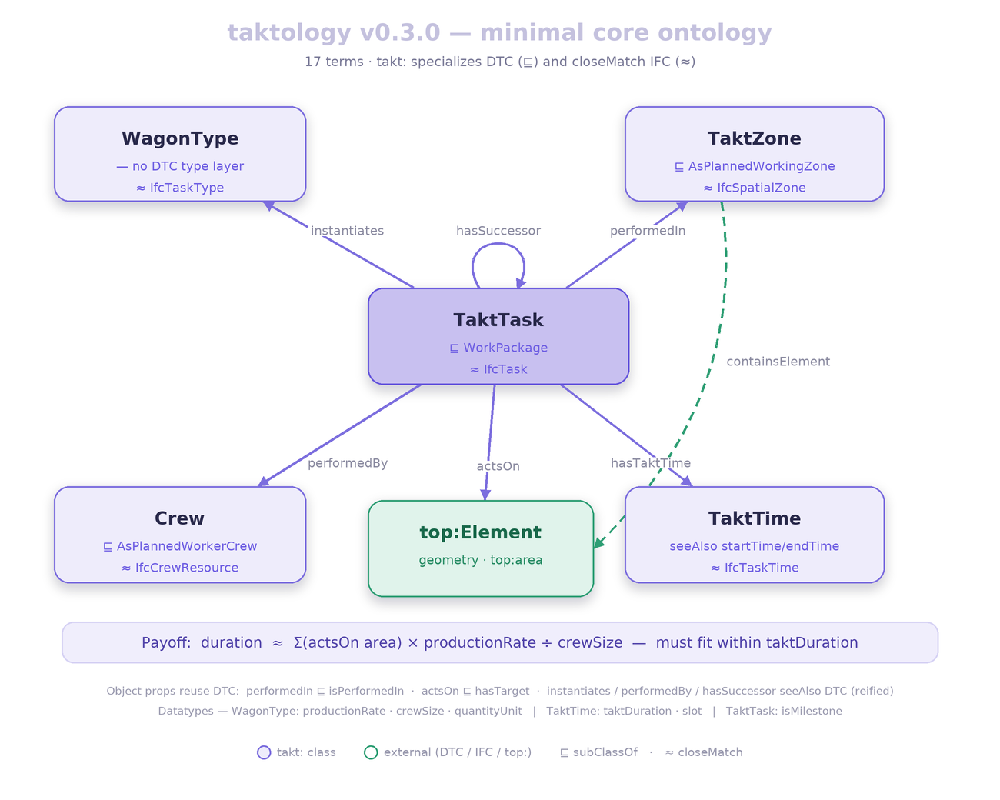

# Taktology

A minimal, modular interchange vocabulary for **takt / Lean construction production
planning** — the kind of plan you build as a coloured grid of *wagons* flowing
through *takt zones* over time.

It models the **takt-specific** half of takt planning (the wagon type-layer, the takt
rhythm, work-density effort values) as a thin layer that **reuses the
[DTC ontology](https://dtc-ontology.cms.ed.tum.de/ontology/)** (`dtc:`) for the
process / working-zone / crew backbone, uses [TopologicPy](https://wassimj.github.io/topologicpy/ontology/topologicpy.ttl)
(`top:`) as the geometry/graph engine, and is anchored to IFC process concepts
(`IfcTask`, `IfcRelSequence`, …) by `skos:closeMatch` — **not** by importing the heavy
ifcOWL schema. DTC itself imports [BOT](https://w3id.org/bot#); `dtc:` and `top:` meet
at BOT, so they compose.

> Origin: this repo is the synthesis of a research conversation working from the
> BIMTakt paper (Becker & Tschickardt, 2023) toward an interoperable,
> manufacturer-neutral model. See [docs/](docs/) for the full reasoning.

## What's here

| Path | What it is |
|---|---|
| [`ontology/takt.ttl`](ontology/takt.ttl) | **The vocabulary** (T-Box), v0.3.1 minimal core. 17 terms: 5 classes, 6 object properties, 6 datatype properties — each `dcterms:source`-cited to the research corpus, each aligned to DTC + IFC. The takt zone subclasses `top:FunctionalZone` (hence `bot:Zone`) for topology/adjacency. |
| [`examples/lumi-b5-1.ttl`](examples/lumi-b5-1.ttl) | A worked **A-Box** — wagon 5.2 in zone B5:1 from a real takt plan, exercising every term, with duration computed end-to-end. |
| [`schema/takt-topology-schema.yaml`](schema/takt-topology-schema.yaml) | Node + edge definitions for a **property-graph build** (Neo4j / NetworkX / rdflib), plus the generation loop. |
| [`scripts/takt_production_ingester_plan.md`](scripts/takt_production_ingester_plan.md) | Implementation plan for an **IFC + wagon-table → takt graph** ingester. |
| [`docs/`](docs/) | Architecture, vocabulary, design decisions (ADRs), and BIMTakt background. |
| [`research/`](research/) | **Research corpus** — 37 verified sources grounding the design ([INDEX](research/INDEX.md), [manifest](research/manifest.json), per-source notes, [ADR-001](research/decisions/ADR-001-research-grounding.md)). |

## The core idea in one picture

<!-- ONTOLOGY-DIAGRAM:START (generated by scripts/generate_ontology_diagram.py — do not edit) -->



<!-- ONTOLOGY-DIAGRAM:END -->

> The diagram above is generated from [`ontology/takt.ttl`](ontology/takt.ttl) — regenerate
> it after any ontology change with `python scripts/generate_ontology_diagram.py`
> (see [Regenerating the diagram](#regenerating-the-diagram)).

A **wagon** is a trade's work package; its per-zone occurrences are **takt tasks**;
the ordered chain of tasks is the **train** (no class — just the `hasSuccessor` chain);
the **takt zone** is the work area they flow through. One graph traversal runs from a
task to the geometry that drives its duration (`task → actsOn → element → area`) —
which a spreadsheet cannot do.

## Design stance (the short version)

- **Author only the gap.** DTC already provides the process, working zones, and crews;
  `top:` computes the geometry. This repo adds *only* what neither has — the wagon
  type-layer, the takt rhythm, and work-density values.
- **Reuse DTC; align, don't import.** Takt terms subclass DTC by *reference* (no
  `owl:imports`); IFC is the `skos:closeMatch` anchor; ifcOWL's ~14k axioms are never
  imported. Round-tripping to `.ifc` is a converter's job.
- **You haven't left IFC.** You keep IFC's process model as the reference; you only
  choose whether the `.ifc` file is your transport format. Format ≠ semantics.
- **`actsOn` ≠ `performedIn`.** A task's *operand* (the elements it builds/operates
  on) is a distinct, direct link — separate from the *location* (the zone). The
  duration formula reads the operand, not the zone total.

Full rationale in [docs/03-decisions.md](docs/03-decisions.md).

## Research grounding

The design is evidence-based, not vibes. [`research/`](research/) is a curated corpus
of **37 verified sources** across takt theory, location-based planning, takt+BIM
automation, IFC/ontologies, and implementation case studies — each tracing to a
decision via [ADR-001](research/decisions/ADR-001-research-grounding.md). The corpus's
headline finding: **no takt-specific ontology exists** in the literature (taktology
fills the gap), and geometry-driven takt zoning has little prior art (a build risk,
flagged honestly in [the gaps section](research/INDEX.md#gaps-where-taktology-designs-with-thin-evidence--most-valuable-section)).
Start at [research/INDEX.md](research/INDEX.md).

## Validating the ontology

Both files **parse cleanly** as Turtle (rdflib 7.6, v0.3.0): `takt.ttl` = 129 triples,
`lumi-b5-1.ttl` = 38 triples. A consistency check confirms the A-Box uses **only**
terms the T-Box defines (all 17), and every term carries a `dcterms:source`. What is
**not** yet done: a reasoner run against the *imported* DTC/IFC ontologies (alignment
is by reference, so load DTC to check the `subClassOf`/`subPropertyOf` axioms hold).

```bash
python -c "import rdflib; rdflib.Graph().parse('ontology/takt.ttl')"   # syntax
riot --validate ontology/takt.ttl examples/lumi-b5-1.ttl               # Apache Jena
# or load both + DTC in Protégé and run a reasoner for full consistency
```

## Regenerating the diagram

The graph at the top of this README is **rendered from the ontology**, not drawn by
hand: [`scripts/generate_ontology_diagram.py`](scripts/generate_ontology_diagram.py)
parses [`ontology/takt.ttl`](ontology/takt.ttl) and emits a versioned PNG to
[`docs/diagrams/`](docs/diagrams/), then repoints the README image block at it. The
version label, term count, every `⊑` (DTC `subClassOf`) and `≈` (IFC `closeMatch`)
alignment, the object-property arrows and the datatype footer all come from the
Turtle — so bumping `owl:versionInfo` and re-running gives a new, in-sync picture.

```bash
pip install -r scripts/requirements.txt   # rdflib + Pillow (one-time)
python scripts/generate_ontology_diagram.py
```

It validates as it renders: if the ontology grows a class or object property the
layout doesn't place, the script **fails** rather than emit a diagram that omits it
(add the box/arrow in the script's `NODES` / `EDGES`, then re-run). Output is pure
Pillow — no SVG rasteriser, Graphviz or browser needed — with fonts bundled under
[`scripts/assets/fonts/`](scripts/assets/fonts/) so the result is identical on every
OS and in CI.

## Open items before publishing

- **Namespace.** `https://w3id.org/taktology#` is the *intended* permanent
  namespace; the w3id.org redirect must be registered first. Until then it is a
  placeholder and does not resolve.
- **`top:` / `dtc:` namespace URIs.** Verify the exact TopologicPy namespace against
  its published `.ttl`, and the **DTC version** (a v2 exists at `.../ontology/v2/`;
  v0.3.0 maps to the v1 terms).
- **Schlenger mapping.** Its ontology terms weren't extractable here (PDF unreadable);
  a finer `takt:`↔Schlenger map is deferred (DTC covers the substance — Schlenger
  builds on DTC).
- **Train Reading A vs B.** The vocabulary encodes Reading A (cross-trade convoy).
  Confirm with the team; it changes where every sequence edge goes.

## License

[CC BY 4.0](LICENSE) — Creative Commons Attribution 4.0 International. Reuse and
adapt freely (including commercially) with attribution. The referenced TopologicPy
ontology is AGPLv3, but this repo only references its namespace (it imports no
TopologicPy code), so it is not bound by AGPL.
