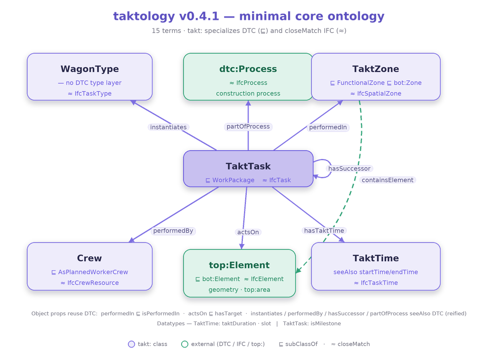

# Taktology visualizer

Three application layers over **one** RDF graph — the point taktology exists to
make: the plan a planner edits, the semantic graph underneath it, and the
building it describes are the *same data*, not three exports that drift apart.



## Run it

```bash
# from the repo root
python -m http.server 8000
# then open http://localhost:8000/viz/
```

Or just double-click `viz/index.html` — a snapshot of the demo data is embedded
in the page so it works over `file://` too (browsers block `fetch()` there).

## The three layers

| Layer | What it is | Reads from the graph |
|---|---|---|
| **Takt plan grid** (top) | What a takt-planning app shows the planner: wagons × zones × takts, the coloured flowline. Click a cell to select it. | `takt:TaktTask` cells by `performedIn` (row) × `slot` (column), coloured by `instantiates` wagon |
| **Knowledge graph** (left) | The ontology as it actually is — tasks, zones, wagons, crews, elements and the typed edges between them. Drag nodes; toggle elements/crews. | every `takt:` triple; flow edges are `hasSuccessorSameZone` (Reading A) and `hasSuccessorSameWagon` (Reading B) |
| **3D building** (centre) | An anonymized 3-storey building — structural shell + architectural + MEP fit-out — that **builds up takt-by-takt** as you scrub. Toggle disciplines; orbit/zoom. | zones tint by the wagon active at the current `slot`; each element appears when the task that `actsOn` it reaches its slot |

The **scrubber** (top bar) is the shared clock: move it and all three layers move
together. **Play** runs the train. Selecting anything in any layer highlights it
in the other two and opens it in the **inspector** (every triple, both directions).

## Where the data comes from

The semantics live in [`examples/takt-building-demo.ttl`](../examples/takt-building-demo.ttl)
(a valid takt plan — it passes `scripts/validate.py`). **Geometry does not** —
coordinates are a side-table in `index.html` keyed by the same element IRIs the
generator emits (`ex:{key}_L{s}_{W|E}`). That mirrors how it works in production:
the ontology carries semantics, **TopologicPy's TGraph carries the coordinates and
computes the quantities** (see [`docs/05-tgraph-pairing.md`](../docs/05-tgraph-pairing.md)).
Swap in a real `TGraph`-built plan and the three layers light up the same way.

## Regenerating the demo

```bash
python scripts/generate_building_demo.py   # rebuild examples/takt-building-demo.ttl
python scripts/embed_viz_data.py           # refresh the file:// snapshot in index.html
python scripts/validate.py                 # confirm the plan still conforms
```

## Dependencies

None to install — [N3.js](https://github.com/rdfjs/N3.js) (Turtle parsing),
[D3](https://d3js.org/) (graph), and [three.js](https://threejs.org/) (3D) load
from a CDN, so an internet connection is needed on first load. No build step.
